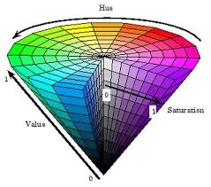
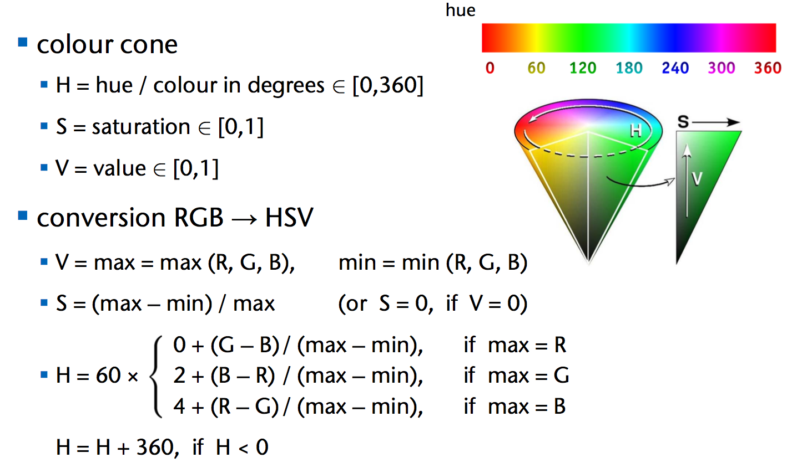

# Fire_smoke_detector


## Introduction

Developed a Fire-Alarm system that detects fire and smoke using OpenCV. This project implements a computer vision based technique for detecting fire and identifying hazardous fire by processing the video data generated by an ordinary camera.

## Technologies
- Python
- OpenCV
- SMTPLIB
- HSV color Algorithm

  


## What is HSV color algorithm?





Color isolation can be achieved by extracting a particular HSV (hue, saturation, value) from an image. The algorithm is simple and the main steps are as follows:

- Step 1 - RGB to HSV Conversion
- Step 2 - Apply a Threshold Mask

We want to convert the image to HSV because working with HSV values is much easier to isolate colors. In the HSV representation of color, hue determines the color you want, saturation determines how intense the color is and value determines the lightness of the image. As can be seen in the image below, 0 on the wheel would specify a mild red color and 240 would specify a blue color.

## Configuration & Setup

- Install playsound

  ```
    pip install playsound
  ```

- Install OpnCV

  ```
    pip install opencv-python opencv-contrib-python
  ```
## Execution

  ```
    python fire-detection.py
  ```


